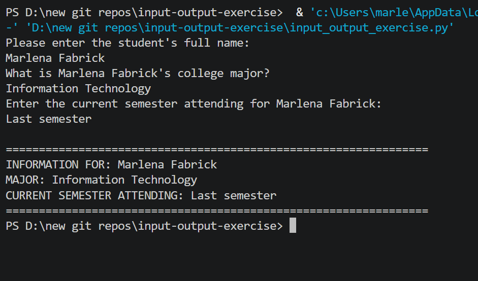

# 🎓 Student Information Input-Output Exercise

A beginner Python program that demonstrates fundamental input and output operations using string variables. Collects a student's name, college major, and current semester, then displays the information in a formatted report.

---

## ✨ Features

- Collects three string inputs from the user
- Displays all entered data in a clean formatted output block
- Initializes variables to empty strings — demonstrates best practices
- Fixed syntax error from original — converted invalid triple-quote after a comment to a proper comment

---

## ⚙️ How It Works

1. Variables are initialized to empty strings
2. User is prompted for the student's full name
3. User is prompted for the student's college major
4. User is prompted for the current semester
5. All three values are displayed in a formatted summary block

---

## 💻 Example Output

```
Please enter the student's full name:
Fabrick, Marlena
What is Fabrick, Marlena's college major?
Computer Programming
Enter the current semester attending for Fabrick, Marlena:
Fall 2020

================================================================
INFORMATION FOR: Fabrick, Marlena
MAJOR: Computer Programming
CURRENT SEMESTER ATTENDING: Fall 2020
================================================================
```

---

## 📸 Screenshot



---

## 🐛 Bug That Was Fixed

The original code had a triple-quote `'''` that started immediately after a `#` comment on the same line:
```python
# Initialize variables to ensure accuracy of stored data '''
```
This caused a `SyntaxError` because Python read the `'''` as the start of an unterminated string. Fixed by removing the triple-quote and keeping it as a proper comment.

---

## 🛠️ Technologies Used

- Python 3
- `input()` and `print()` — console I/O
- String variables and concatenation
- Variable initialization to empty strings

---

## 📚 Learning Outcomes

- Declaring and initializing string variables
- Using `input()` to collect user data
- String concatenation with `+`
- Displaying formatted output with `print()`
- Basic Python program structure

---

## ▶️ How to Run

1. Make sure Python 3 is installed: https://www.python.org/downloads/
2. Clone or download this repo
3. Open a terminal in the repo folder
4. Run: `python input_output_exercise.py`
5. Follow the prompts to enter student information

---

## 📁 Folder Structure

```
input-output-exercise/
├── input_output_exercise.py
├── output.png
├── README.md
├── LICENSE
└── .gitignore
```

---

## 📜 License

This project is licensed under the MIT License — see the [LICENSE](LICENSE) file for details.

---

*Written by Marlena Fabrick — Computer Programming, Fall 2020*

